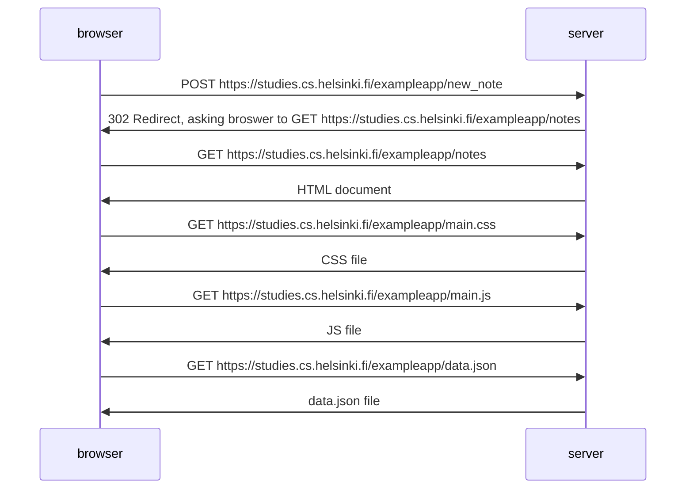

```mermaid
sequenceDiagram
  participant browser
  participant server
  browser->>server: POST https://studies.cs.helsinki.fi/exampleapp/new_note
  server->>browser: 302 Redirect, asking broswer to GET https://studies.cs.helsinki.fi/exampleapp/notes
  browser->>server: GET https://studies.cs.helsinki.fi/exampleapp/notes
  server->>browser: HTML document
  browser->>server: GET https://studies.cs.helsinki.fi/exampleapp/main.css
  server->>browser: CSS file
  browser->>server: GET https://studies.cs.helsinki.fi/exampleapp/main.js
  server->>browser: JS file
  browser->>server: GET https://studies.cs.helsinki.fi/exampleapp/data.json
  server->>browser: data.json file
```
